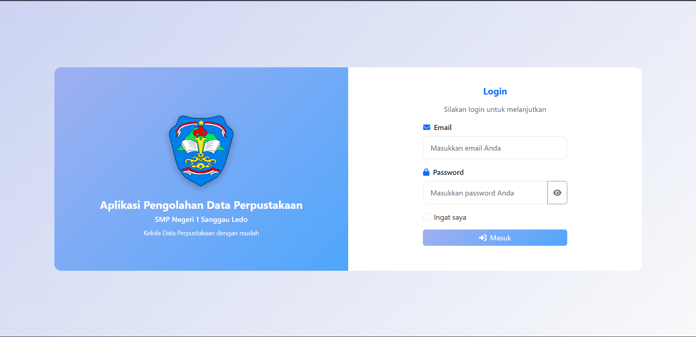
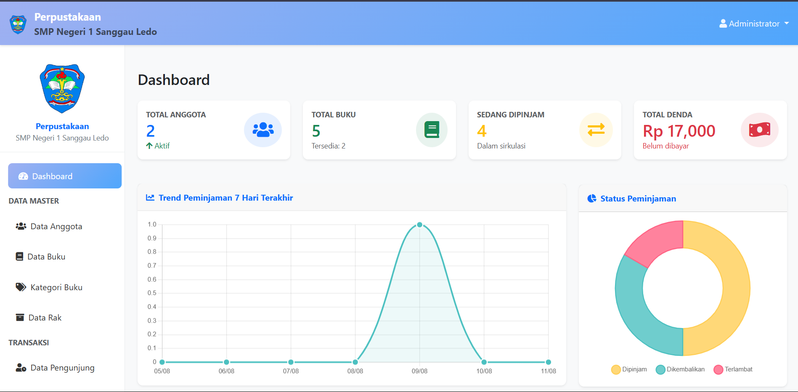
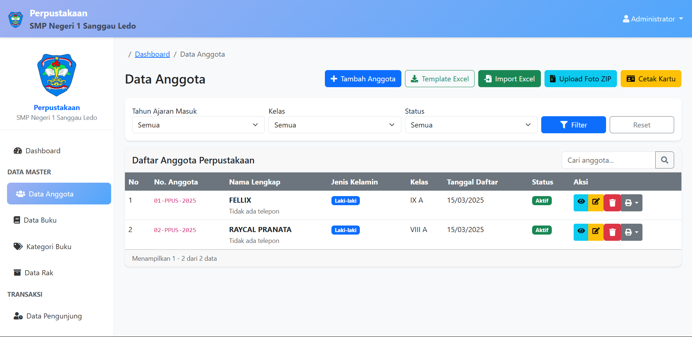
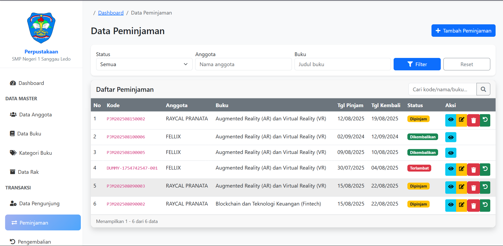
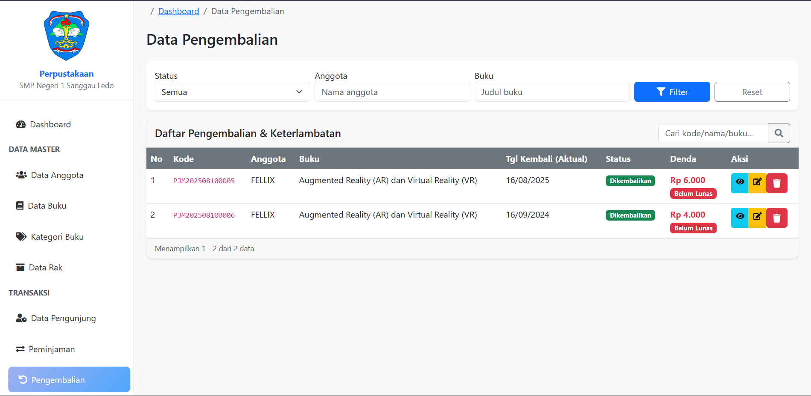
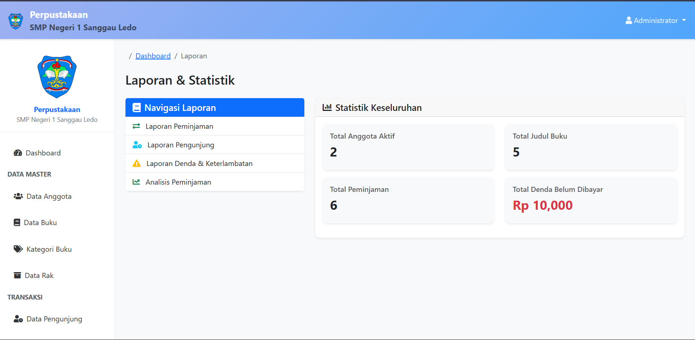
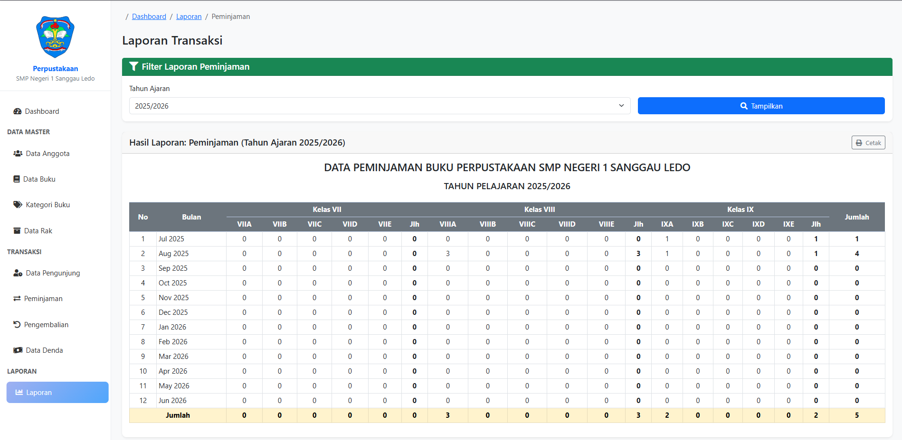

## 1. Judul & Deskripsi

Aplikasi Pengolahan Data Perpustakaan Berbasis Web di SMP Negeri 1 Sanggau Ledo

Aplikasi web yang digunakan untuk mengelola data anggota, buku, transaksi peminjaman/pengembalian, denda, pengunjung, serta laporan dan analisis peminjaman.

---

## 2. Deskripsi Ringkas Fungsi dan Tujuan

Aplikasi ini membantu pustakawan dalam:

- Mencatat dan mengelola data anggota dan buku
- Mengelola transaksi peminjaman dan pengembalian
- Menghitung keterlambatan dan denda
- Mencatat data pengunjung perpustakaan
- Menyajikan laporan dan statistik untuk pengambilan keputusan

### Fitur Utama

- Data Anggota: tambah, ubah, hapus, cetak kartu, import Excel, upload foto ZIP
- Data Buku: tambah, ubah, hapus, kategori buku, data rak
- Transaksi: peminjaman, pengembalian, perhitungan denda
- Data Pengunjung: pencatatan kunjungan harian
- Laporan: peminjaman, pengunjung, denda & keterlambatan, analisis peminjaman per kelas
- Dashboard: ringkasan metrik (anggota aktif, judul buku, peminjaman, denda)

---

## 3. Teknologi yang Digunakan

- Framework: Laravel (PHP 8.x)
- Frontend: Blade + Bootstrap 5, Vite
- Database: MySQL/MariaDB
- Tooling: Node.js & npm

---

## 4. Instalasi & Konfigurasi

1) Siapkan lingkungan
   - XAMPP aktif (Apache & MySQL) atau gunakan built-in server Laravel.
   - PHP 8.x, Composer, Node.js & npm sudah terpasang.

2) Ambil kode sumber
   - Letakkan proyek di `C:\xampp\htdocs\TUGASAKHIR\Perpustakaan` (contoh pada Windows).

3) Pasang dependensi
   - Jalankan `composer install`
   - Jalankan `npm install`

4) Konfigurasi `.env`
   - Salin contoh: `copy .env.example .env`
   - Generate key: `php artisan key:generate`
   - Atur koneksi database (contoh):
     - `DB_CONNECTION=mysql`
     - `DB_HOST=127.0.0.1`
     - `DB_PORT=3306`
     - `DB_DATABASE=perpustakaan`
     - `DB_USERNAME=root`
     - `DB_PASSWORD=` (kosong jika default XAMPP)
   - Buat database dengan nama yang sama di phpMyAdmin.

5) Migrasi & (opsional) seeder
   - Migrasi: `php artisan migrate`
   - Seeder (jika tersedia): `php artisan db:seed`

6) Menjalankan aplikasi
   - Dev server: `php artisan serve` lalu akses <http://127.0.0.1:8000>
   - Atau via XAMPP: arahkan virtual host/URL ke folder `public/`

7) Aset front-end
   - Mode pengembangan: `npm run dev`
   - Build produksi: `npm run build`

Catatan: Jika perubahan tidak muncul, coba `php artisan config:clear` dan `php artisan route:clear`.

---

## 5. Tata Cara Penggunaan Aplikasi

1) Login
   - Buka aplikasi lalu masukkan email dan kata sandi.
   - Klik tombol "Masuk". Jika gagal, pastikan kredensial benar atau hubungi admin.

2) Mengenal Dashboard
   - Lihat kartu ringkasan: Total Anggota, Total Buku, Sedang Dipinjam, Total Denda.
   - Grafik tren peminjaman dan diagram status membantu memantau aktivitas.
   - Gunakan menu sisi kiri untuk menuju modul: Data Master, Transaksi, Laporan.

3) Menambah Anggota Baru
   - Navigasi: "Data Master" > "Data Anggota" > klik tombol "Tambah Anggota".
   - Isi data wajib: No. anggota (jika otomatis, biarkan), nama lengkap, jenis kelamin, kelas, kontak.
   - Simpan. Anggota akan tampil di tabel dengan status "Aktif".
   - (Opsional) Import massal: klik "Import Excel" setelah mengunduh "Template Excel" dan mengisi datanya.
   - (Opsional) Upload foto massal: gunakan "Upload Foto ZIP" dengan struktur nama file sesuai nomor anggota.

4) Mencetak Kartu Anggota
   - Pada halaman "Data Anggota", centang baris yang ingin dicetak.
   - Klik tombol "Cetak Kartu" untuk menghasilkan dokumen cetak/PDF kartu anggota.

5) Menambah Buku
   - Navigasi: "Data Master" > "Data Buku" > klik "Tambah Buku".
   - Isi judul, pengarang, penerbit, tahun, kategori, lokasi rak, dan stok eksemplar.
   - Simpan. Pastikan kategori dan rak tersedia (kelola di menu "Kategori Buku" dan "Data Rak").

6) Melakukan Peminjaman
   - Navigasi: "Transaksi" > "Peminjaman" > klik "Tambah Peminjaman".
   - Pilih anggota dan buku. Sistem akan memvalidasi stok dan batas pinjaman.
   - Atur tanggal pinjam dan tanggal jatuh tempo. Klik "Simpan".
   - Status peminjaman akan muncul pada tabel sebagai "Dipinjam".

7) Memproses Pengembalian & Denda
   - Navigasi: "Transaksi" > "Pengembalian".
   - Cari transaksi via kolom pencarian (kode, nama anggota, atau judul buku).
   - Buka detail, klik "Simpan Pengembalian". Jika lewat jatuh tempo, denda dihitung otomatis.
   - Jika aplikasi mendukung pelunasan, catat pembayaran hingga status denda menjadi "Lunas".

8) Mencatat Data Pengunjung
   - Navigasi: "Transaksi" > "Data Pengunjung".
   - Klik "Tambah" dan isi nama/kelas (atau identitas lain sesuai form), lalu simpan.

9) Membuat Laporan
   - Navigasi: "Laporan".
   - Pilih jenis laporan: Peminjaman, Pengunjung, Denda & Keterlambatan, Analisis Peminjaman.
   - Tentukan tahun ajaran/periode tanggal dan filter tambahan, klik "Tampilkan".
   - Gunakan tombol "Cetak" untuk menyimpan sebagai PDF atau mencetak.

10) Pencarian & Filter Cepat

- Gunakan kolom "Cari..." di kanan atas tabel untuk mencari berdasarkan kode/nama/judul.
- Gunakan panel filter (status, anggota, buku, tanggal) lalu klik "Filter" untuk menyaring data.

11) Tips Operasional

- Bila tombol aksi tidak terlihat, cek hak akses/role akun Anda.
- Perbarui data stok saat ada penambahan/pengurangan fisik buku agar laporan akurat.
- Lakukan backup database berkala melalui phpMyAdmin agar data aman.

---

## 6. Screenshots (Opsional)

## 6. Screenshots

### Login



### Dashboard



### Data Anggota



### Peminjaman



### Pengembalian



### Laporan




---

## 7. Struktur Folder (Opsional)

```
Perpustakaan/
  app/
  resources/
    views/
    js, css
  public/
  routes/
  database/
  storage/
```

---

## 8. Lisensi

  

**Private License**  

Copyright (c) 2025 Fellix666  

Project ini adalah perangkat lunak yang bersifat **private**.  
Hanya boleh digunakan untuk kepentingan internal **SMP Negeri 1 Sanggau Ledo** dan penelitian akademik terkait.  

Dilarang keras untuk:  
- Menyalin  
- Mendistribusikan  
- Memodifikasi  
- Menggunakan ulang project ini  

tanpa izin tertulis dari pemilik/pengembang.  

---

## Authors

- **Fellix666** – [GitHub Profile](https://github.com/Fellix666)

